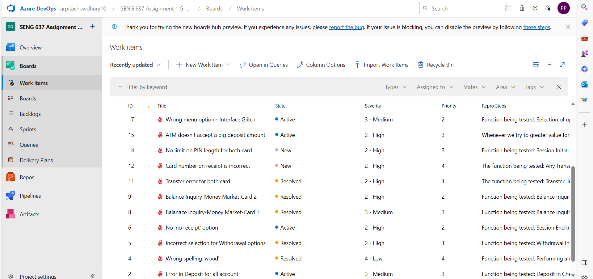

>   **SENG 637 - Dependability and Reliability of Software Systems**

**Lab. Report \#1 – Introduction to Testing and Defect Tracking**

| Group: 4      |
|-----------------|
| Student 1 Arpita Chowdhury                |   
| Student 2 Fadila Abdulai Hamid             |   
| Student 3 Kumkum Akter             |   
| Student 4 Niloofar Sharifisadr              |
| Student 5 Pratishtha Pratishtha |  

**Table of Contents**

[1 Introduction	1](#intro)

[2 High-level description of the exploratory testing plan	1](#hld)

[3 Comparison of exploratory and manual functional testing	1](#evm)

[4 Notes and discussion of the peer reviews of defect reports	1](#peer)

[5 How the pair testing was managed and team work/effort was
divided	1](#team)

[6 Difficulties encountered, challenges overcome, and lessons
learned	1](#diff)

# Introduction 

In this Lab we worked to make the first bug report for the given SUT, here being the two versions of the ATM(v1.0 vs v1.1) application. This bug report will consist of 2 main aproaches or techniques.

Exploratory Testing: a more informal and unscripted approach that emphasizes the tester's freedom and creativity while they explore the functionaltities of a given system. Testers dynamically devise and execute tests based on their understanding of the application's behavior.

Manual Scripted Testing: a structured approach where testers follow a predefined set of test cases to verify the functionality of an application. The tests are scripted, specifying the steps to be taken, the expected results, and the actual outcomes. It's methodical and repeatable, ensuring that the application works as intended in expected use-case scenarios.

This was followed by regression testing to keep track of which bugs have been solved in the new version while also performing exploratory and manual scripted testing on v1.1, and finally presenting report where bugs are marked as new(found in v1.1 only), in-progress(bugs found in both versions) and resolved(bugs found in v1.0 only).

None of our groups' members have prior experience with testing but working as a group helped each one of us explore and learn better. Our understanding of exploratory testing, was testing the SUT with no pre-defined structure and plan and as the name suggests, exploring different functionalities of the SUT on a trial and error basis. The learning knowledge for bugs here was simultaneous to execultion of the application. And what we assumed about the scripted testing, was scenario-based testing with pre-defined scenarios and plans that a person with background knowledge has prepared, for which we referred to the test cases provided in Appendix C of assignment guidelines.

In this report, we have recorded exploratory testing results as well as MFT using Azure bug tracking tool for both versions of the SUT (ATM application).

# High-level description of the exploratory testing plan 

The below points summarize the high-level description of the exploratory testing plan that we followed among each pair. 
 
The approach being taken: 
1. Explore the common routines that a user would do when they visit the ATM. 
2. Also explore what the user can potentially do when he visits the ATM, like pressing incorrect buttons or canceling it in the middle of the transaction. 
3. Explore all the functions that come to our mind. 
4. After every transaction, check the balance in the available accounts, and the logs to verify if everything has been recorded correctly. 
5. Check the receipt generated to see if it captures the correct details.
   
 Functionalities being targetted:
1. Viewing the balance of available accounts. 
2. Deposit of cash. 
3. Withdrawal of cash. 
4. Transfer of money. 
5. Verify the receipt. 
6. Verify the logs. 

# Comparison of exploratory and manual functional testing 

Exploratory Testing is good at finding problems that aren't usually expected during normal use. How well exploratory testing works depends a lot on the tester's knowledge of the System Under Test (SUT). If the tester knows the SUT's functional needs and what should happen, they can explore unusual scenarios that might reveal issues. In our exploratory testing, we made sure to use all the main features like Deposit, Withdrawal, Transfer, and Balance Inquiry and also tried to find unusual cases. For example, we tried to enter a very long PIN code for the card ans system didn't throw eny errors; or interface glitches or wrong spellings('wood' nstead of would); these are rare cases that a Manual Functional Test (MFT) might not cover. Exploratory testing is great for coming up with creative tests that would be hard to plan for in MFT. Basically, exploratory testing can find unexpected problems, but how well it works really depends on the tester's knowledge of the app and the quality of the test plan. The best person to do exploratory testing or make the test plan is someone who really knows what the app should do. Also, how much time you have for testing affects exploratory testing; in our lab, we only had 30 minutes, which led to finding about 15-20 issues. More time could mean finding more problems.

On the other hand, Manual Functional Testing (MFT) is a more organized way of testing and works well for checking the usual ways of using the SUT. MFT is a step-by-step process with all the tests already set out. The depth of these tests decides how good MFT is. In the lab, the tests in Appendix C were basic and didn't look for unusual cases, which means we didn't use MFT to its full potential. A big plus of MFT, compared to exploratory testing, is that the tester doesn't need to know a lot about the SUT because they just follow the steps, which makes the process faster. In the end, how good MFT is will really depend on how well the tests are written.

In conclusion, exploratory testing and MFT both have their pros and cons, exploratory testing is better at identifying uncommon use cases, while MFT is very effective at uncovering the common use cases. Exploratory testing lacks efficency in the sense that the tester has to have an in-depth understand of the SUT before testing and has time limits for testing. On the other hand, MFT depends on how well the test cases are written and does not require the background knowledge of the system for the tester. Therefore, MFT can be more efficent in terms of how many use cases are tested. Overall, both scenarios are required when dealing with testing a system: The developers of the SUT would perform a preliminary exploratory testing, then afterwards the MFT can be done by a tester who doesnt necessarily have a great understanding of the SUT.

# Notes and discussion of the peer reviews of defect reports 

We divided the five people in our group into two sub-groups according to the guidelines in the lab manual regarding pair testing methodology. At least two individuals worked together in each group for each identified bug. This collaborative peer review process helped filter out multiple false-positive bug reports based on discussions on results. Additionally, our team members provided constructive feedback while cross-referencing our internal documentation among our sub-groups for accuracy.
Following this framework, we noted and replicated the bugs identified for version 1.1 protocols. When one individual submitted a bug report, their sub-group partners assessed their work to ensure the prescribed format was followed and to weigh on the presence of those bugs. This review process helped guarantee that each report contained all relevant information, facilitating the accurate diagnosis and understanding of the defect's nature and underlying causes.
We followed the lab manual's guidelines for bug reporting, which included reporting on the function being tested, the system's initial state, specifying the steps required to reproduce the bug, and each test case’s expected and actual outcome.

# How the pair testing was managed and team work/effort was divided 

For this assignment, the essential requirement was pair testing, so we divided our group of five into two sub-groups- Sub-group 1(Pratishtha and Fadila) and sub-group 2(Arpita, Kumkum, Niloofar) performed testing based on the lab manual. The groups explored the system under test, i.e., the ATM Machine v1.0, to understand its functionalities better and performed exploratory testing where one individual ran the test case or any exploratory test case they realized. At the same time, the other person interpreted the results, and the roles were alternated so that both could get hands-on experience in each role. This process was followed by discussions on the bugs reported. The two sub-groups created bugs as work items on the Azure platform. The guidelines provided for Regression testing were followed. Working in pairs helped this process be more efficient as partners provided unique viewpoints and thus minimized the chance of errors. Ultimately, the bugs obtained by exploratory and manual scripted testing were combined, keeping both versions of the ATM in mind. A snapshot of Azure Dashboard is added for reference.

# Difficulties encountered, challenges overcome, and lessons learned 

One of the difficulties we encountered was in conducting exploratory tests. Every pair of groups reported a comparable set of issues. Thus, we received two reports of the same bug, each with a different description. It was impossible to replicate a few of the reported issues. So we had to delete some bugs from Azure. 

It was challenging to combine all those bugs and keep only the unique ones. We resolved this by virtually gathering, talking about the findings of each pair, and then having one person go over every issue to compile them into a single document with assistance from the others. Throughout this procedure, we tested every bug that had been reported, removing bugs that could not be recreated at all. Another challenge we faced in the time of committing in GitHub, when we were committing together, GitHub did not allow us to commit as another person was working in the same repository.

As for exploratory testing, we should not go for too many details as it takes so long time. We also learned how Azure platform works for Bug tracking and task management. Also, the lesson learned from this was to have a guideline in the process that is to be followed. This guideline/best-practice made sure that bugs we raised not only captured detailed information but also ensured that the information logged is easy to follow.
